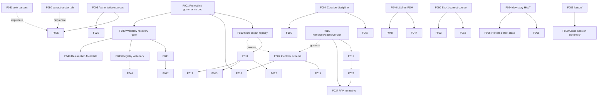

# 03 — Master Catalogue (Phase 5 synthesis)

**Date:** 2026-04-29
**Source:** consolidated from `00-prior-context.md`, `01-project-inventory.md`, `04-evolution-audit.md`, user answers in `05-open-questions.md`.

> One row per unique finding. N evidence rows where N projects exhibit it. Foundational findings (D-tier and E1) tagged `tier: substrate`.

---

## Tier 0 — Project-level governance (NEW, per A11)

Required regardless of substrate (BMAD/GSD/pro-workflow). No Wave 1+ work ships without this scaffolding.

| ID | Title | Category | Tier | Evidence | Maps to |
|---|---|---|---|---|---|
| F001 | Project initialization missing governing document | E2 + new | governance | "slop dropping files wherever, and then languishing" (A11) | All projects |
| F002 | Identifier schema not project-level governed | B4 | governance | FR-1, FR-2, RS-5 | All projects |
| F003 | Authoritative sources not declared | B2 | governance | "authoritative sources clearly specified" (A11) | linkml mixes adoc/yaml/md |
| F004 | Curation discipline absent | E1 | governance | "meticulously curated" (A11) | linkml `liaison/`, `failings/`, `learnings/` partial |

---

## Tier 1 — Substrate format & schema (D-category + RS + FR)

| ID | Title | Cat | Tier | Evidence | Map to evolutions |
|---|---|---|---|---|---|
| F010 | YAML registry schema cannot represent multi-output workflows | D3 / RS-1 | substrate | kai/Elements adopted flat keys + list-valued `prd:` | E3 redesign |
| F011 | `status` field overloaded (enum OR file-path OR prose) | D5 / RS-2 | substrate | All 4 registry instances | E3 redesign |
| F012 | Missing `create-epics-and-stories` template entry | D3 / RS-3 | substrate | luka, teague registries | E3 D3 |
| F013 | Field-set drift across registries | D5 / RS-4 | substrate | `command:`, `notes:`, `last_workflow:`, `brainstorming:` | E3 redesign |
| F014 | No subsystem prefix on workflow names | B4 / RS-5 / FR-2 | substrate | All 4 registries; FR-extraction | Cross-evolution |
| F015 | Schema lacks rationale/traces/version metadata | D2 / RS-6 / FR-3 | substrate | All registries; `extracted/*.yaml` schema | Q9 ADR-capture mission |
| F016 | No diff-friendly canonical form | D5 / RS-7 | substrate | Blocks Q10 review-extract-diff loop | Wave 2 prerequisite |
| F017 | Project rename drift not handled | D5 / RS-8 | substrate | teague's `project_name: "genmap"` | E3 redesign |
| F018 | FR numbering restarts at -001 per document | B4 / FR-1 | substrate | "ROOKIE move" per Factweave 2026-03-24 | New skill |
| F019 | Schema lost rationale/source/traces/phase/strength/test_procedure | D2 / FR-3 | substrate | `fwa-user-stories.yaml` vs proposed schema | Q9 |
| F020 | Cross-reference mechanics absent in markdown PRDs | D1 / FR-4 | substrate | adoc `<<file.adoc#{idprefix}ID,…>>` pattern | New skill |
| F021 | "Includes" provenance lost in YAML extraction | D2 / FR-5 | substrate | `Includes VM-US-001, …` not in YAML | Bidirectional pipeline |
| F022 | No traceability matrix FR→UC→US→DM→test | D3 / FR-6 | substrate | Architecture repo lacks matrix | PAV-first |
| F023 | Capability-area hierarchy implicit, not metamodel | D5 / FR-7 | substrate | adoc structure carries it; YAML doesn't | New schema |
| F024 | AC versioning per-AC, no artifact-level version | D3 / FR-8 | substrate | `version: "current"` per AC | New schema |
| F025 | Multi-format entry not supported (md/yaml/adoc) | D1 | substrate | Per A10: "agile process consumes available material" | New skill |
| F026 | YAML not currently authoritative; adoc extraction is the workaround | D1 | substrate | Per A8 + user clarification | Inversion pattern |
| F027 | PAV traceability discipline not encoded | D2 + new | substrate | Per A10 normative pointer; linkml ADR `6c552e9` | New cross-cutting |
| F028 | Markdown-vs-AsciiDoc-vs-YAML format policy undocumented | D1 | substrate | Per A8 IDE/dashboard integration concerns | Project init skill |

---

## Tier 2 — State machinery (A-category + Evolution-2/3)

| ID | Title | Cat | Tier | Evidence | Map to evolutions |
|---|---|---|---|---|---|
| F040 | Workflow state recovery gate absent (corpus-wide) | A1 | machinery | 0 workflow.md files have `State Recovery Check` section | E2 |
| F041 | step-01b-continue.md absent in 5 P0/P1/P2 targets | A1 | machinery | Audit confirms | E2 |
| F042 | step-01b-continue.md present in 4 other skills (different effort) | A1 | machinery | product-brief, prd, ux-design, architecture | E2 reconcile |
| F043 | Workflow status registry writeback unimplemented | A2 | machinery | 0 markers in src/ | E3 |
| F044 | Generic "update workflow status (if exists)" prose only | A2 / B1 | machinery | 4 completion steps | E3 + E4 cross-cut |
| F045 | bmm-workflow-status.yaml retroactive in linkml | A2 | machinery | header says "state reconstructed from existing artifacts" | E3 evidence |
| F046 | LLM-as-FSM anti-pattern (state-machine sickness) | A1 + A4 + new | machinery | "LOAD the FULL workflow.md" preamble across 8+ projects | A7 — new wave 2 |
| F047 | Agent activation blocks encode FSM in XML prose | new | machinery | `bmad-master.md` `<activation critical="MANDATORY">` | A7 wave 2 stage 2 |
| F048 | Procedural prose unreliable (the shouting itself is evidence) | new | machinery | `IT IS CRITICAL THAT YOU FOLLOW THIS COMMAND` ubiquity | A7 |
| F049 | Workflow Resumption Metadata pattern (linkml Cluster 0) | A1 / A3 | machinery | linkml's analysis: 100% upstream confidence | E2 generalized |
| F050 | Cross-session journal continuity primitive (`liaison/`) | A4 | machinery | linkml + archbox both ship it | New skill candidate |

---

## Tier 3 — Artifact discipline (B/C-category + Evolution-1/4)

| ID | Title | Cat | Tier | Evidence | Map to evolutions |
|---|---|---|---|---|---|
| F060 | Evolution-1 absent from `bmad-correct-course/` | C1/C2/C3 | discipline | 0 markers in any file | E1 P1 install |
| F061 | Evolution-1 absent from `bmad-check-implementation-readiness/` | C1/C2/C3 | discipline | 0 markers across 6 step files | E1 P1 install |
| F062 | Evolution-1 partial in `bmad-validate-prd/` | C2 | discipline | step-v files lack A/P/C gating | E1 P2 expand |
| F063 | Evolution-1 partial in `bmad-create-epics-and-stories/` | C2 | discipline | 4 steps without FACILITATOR | E1 P2 expand |
| F064 | dev-story Step 1 HALTs on missing artifact (not creates) | B1 | discipline | Audit confirms structural defect | E4 |
| F065 | dev-story Step 10 only updates assumed-existing | B1 | discipline | Audit confirms | E4 |
| F066 | "do X (if Y)" defect class corpus-wide | B1 | discipline | E4 generalization principle | Cross-cut |
| F067 | Party Mode decisions not persisted (linkml Cluster 4) | C4 | discipline | "AD-1 through AD-9 lost" (linkml failings file) | E1 / new pattern |
| F068 | Required-section enumeration missing on artifacts | B3 | discipline | E4 README lists what's required | E4 + new |
| F069 | Numbering/naming drift (story IDs, FR IDs) | B4 | discipline | FR-1, FR-2 | F018 substrate |

---

## Tier 4 — Tooling promotion (F-category + extraction infrastructure)

| ID | Title | Cat | Tier | Evidence | Disposition |
|---|---|---|---|---|---|
| F080 | `extract-section.sh` (bash, architecture/elt) | F1 | tooling | 65 lines | Promote (rewrite Python) + deprecate |
| F081 | `parse-{uc,us,ss,dm}.awk` (4 awk scripts, architecture/tools/parsers) | F1 | tooling | 524 lines total | Promote (rewrite Python) + deprecate |
| F082 | `lkml` tool (lkml-gen renamed/folded; Jinja2/Mustache templates) | F1 | tooling | linkml's promoted package | Reference, do not absorb |
| F083 | `liaison/` mailbox protocol | F2 / A4 | tooling | linkml + archbox | Promote as `bmad-liaison` |
| F084 | bmm-workflow-status.yaml retroactive constructor | F1 | tooling | Used in linkml | Replaced by E3 |
| F085 | Section-index files (`.adoc-index`) | F1 | tooling | architecture/elt/ | Promote as part of multi-format pipeline |

---

## Tier 5 — Hygiene (E-category)

| ID | Title | Cat | Tier | Evidence | Disposition |
|---|---|---|---|---|---|
| F100 | BMAD invariants duplicated in projects | E1 | hygiene | All projects vendor `_bmad/`; **all pristine when measured against `_bmad-output/` directory creation epoch** (the correct anchor — not the newest artifact mtime). Customization lives outside `_bmad/`. | Dedup via installer |
| F101 | Slim install vs full install confusion | E2 | hygiene | Two install versions in wild | Document, don't auto-migrate |
| F102 | Config file proliferation | E3 | hygiene | `bmad/config.yaml`, `_bmad/bmm/config.yaml`, registries | Document precedence |
| F103 | `.gitignore` for ephemeral state | E4 | hygiene | linkml's governance VCS strategy (Cluster 3) | Adopt linkml pattern |

---

## Cross-tier cuts

### Single-source (pull from linkml's prior analysis)

linkml has already done G/I/C scoring for upstream contribution. Adopt their priorities:
- Cluster 0 (Workflow Resumption Metadata) — 15/15, maps to F049, F040-F042
- Cluster 3 (Governance VCS) — 15/15, maps to F103, F004
- Cluster 4 (Party Mode persistence) — 15/15, maps to F067
- Cluster 1 (Context Budget) — 14/15, maps to D4 token bloat
- Cluster 2 (Architecture Prerequisite) — 13/15, maps to F040

### Conflict surfaces (route to user via `05-open-questions.md`)

- F010..F017 (registry redesign) — A12 says NOT unified metamodel; pursue decoupled-with-shared-discipline (composition).
- F046..F048 (state-machine sickness) — A7 says incremental: workflow step files first, then pilot agent activation.
- F025..F028 (multi-format entry, PAV, format policy) — A10 + A11 says project-level governance is prerequisite; substrate-agnostic deliverable.

---

## Dependency DAG (Mermaid)

Substrate-tier (F010..F028) and governance-tier (F001..F004) ship FIRST. Machinery (F040..F050) then. Discipline (F060..F069) and tooling (F080..F085) ride on top. Hygiene (F100..F103) last.
